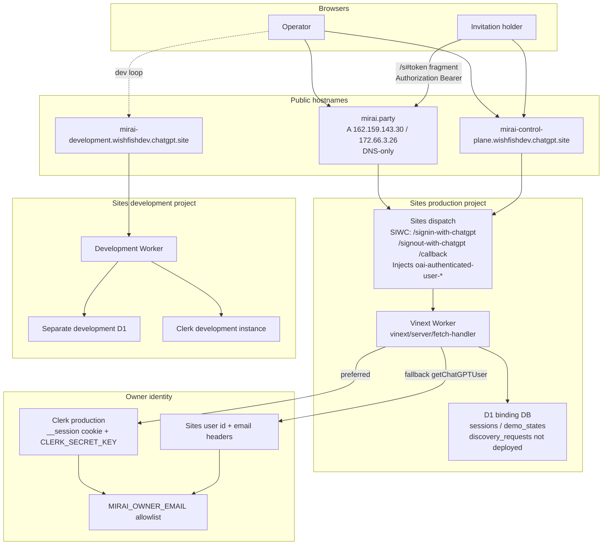

# Sites migration investigation

> **2026-09-11 execution update:** The operator chose an empty new-client
> production database instead of export/copy/remap. See
> [new-client production separation](production-new-clients.md) for the new D1,
> preview deployment and failed Clerk sign-in gate. No domain cutover ran.
> The copy-based phases below are historical proposals, not the active plan.

Investigation date: 2026-09-11. Research and planning only. No deploy, DNS change, production export, runtime-secret edit, or credential commit was performed.

This document answers: what it would take to move Mirai off OpenAI Sites, what the options are, and which path is lowest-risk. Evidence comes from this repository unless a citation names an official Cloudflare or Clerk page.

Related current-state docs: [MVP](../MVP.md), [development](../DEVELOPMENT.md), [working agreements](../../AGENTS.md), discovery chat plan (on the separate conversation-update branch). [North-star](../NORTH-STAR.md) is future product direction, not implemented behavior.

---

## 1. Executive summary

**Recommended path: stay on Sites for production cutover, then migrate to an operator-owned Cloudflare account (Workers + D1) once export, Clerk-only auth, and a committed Worker config exist.** Do not move to Vercel/Supabase or a conventional Node server as the first hosting change.

Mirai is already a Vinext Worker that talks to D1 with parameterized SQL. Local development already works outside Codex. Clerk is already a preferred owner-auth path in `lib/server.ts`. The remaining Sites lock-in is operational, not architectural: Sites provisions D1, injects ChatGPT identity headers, packages `dist/.openai/` plus drizzle, and is the only publish path. There is no standalone release pipeline and no configured Sites backup/export ([DEVELOPMENT.md](../DEVELOPMENT.md)).

Moving to **your own Cloudflare account** keeps the same runtime (React 19, Vinext, D1, invitation bearers, approval/version rules). The real work is: a committed Wrangler config with real database IDs (the generated `dist/server/wrangler.json` uses a placeholder), Clerk-only owner auth with an explicit `owner_id` remap, stripping trusted-header auth before the Worker is public, an operator-only D1 export/import, and a DNS cutover of `mirai.party` after staging gates pass.

**Stay on Sites** is the correct *immediate* posture. It avoids a data/auth cutover while discovery chat is still undeployed and while production `owner_id` values are still Sites user IDs. Use that time to add repeatable local DB setup, broaden CI, and finish Clerk as the only owner sign-in — work that is required for Option 2 anyway.

**Alternative stack** (Vercel + Postgres/Supabase, or a Node server) is a product rewrite: every route uses `cloudflare:workers` / D1 `prepare`/`batch`, discovery uses SQLite `json_extract` / `json_array_length`, and Vinext’s Worker adapter is the server. That is not a configuration change.

Lowest-risk sequence:

1. Keep production on Sites. Do not change `.openai/hosting.json` project ID as ordinary work.
2. Make Clerk the only owner identity on a staging Worker that never trusts `oai-authenticated-user-*` headers.
3. Operator-only: export production D1, remap `owner_id`, import into an operator-owned D1, validate counts and invitation hashes.
4. Run the new Worker on a staging hostname with a copied database. Keep Sites live.
5. Cut `mirai.party` only after staging gates pass. Keep the Sites URL as rollback until the first stable week.

Expected cutover downtime for a small D1 (this MVP lists at most 500 sessions): a short write freeze measured in minutes, not a multi-hour outage — **if** the operator can export Sites D1. That export path is the largest unknown and is operator-only.

---

## 2. Current-state architecture



Facts from this checkout:

| Item | Evidence |
| --- | --- |
| Production Site | `.openai/hosting.json` project `appgprj_6aa18e60d0088191b9e9311ce7a8ecc5`, D1 binding `DB`, R2 `null` |
| Development Site | [DEVELOPMENT.md](../DEVELOPMENT.md): `Mirai — Development`, `appgprj_6aa3b79a2f5c8191a7c1df2fd5dbe084`, separate Clerk + D1 |
| Custom domain | [MVP.md](../MVP.md): `mirai.party` A records `162.159.143.30` and `172.66.3.26`, DNS-only; legacy Sites URL still serves the app |
| Auth | `lib/server.ts` prefers Clerk `__session` + `CLERK_SECRET_KEY`; else `getChatGPTUser()` headers. Email must match `MIRAI_OWNER_EMAIL` |
| Client access | 256-bit bearer in URL fragment; SHA-256 in `sessions.token_hash`; no Sites identity required |
| Publish | Sites connector only: source credential → exact source push → saved build → deploy. No durable publish credential in repo |
| CI | `.github/workflows/verify.yml` typechecks, lints, runs `tests/demo-engine.mjs`, builds. Does not publish. Lifecycle HTTP tests are local-only |
| Local D1 ID | `vite.config.ts` placeholder `00000000-0000-4000-8000-000000000000` / name `site-creator-d1` |
| Discovery chat | Implemented locally; not deployed. Needs `MIRAI_DISCOVERY_ENABLED` + `MIRAI_OPENAI_API_KEY` and migration `0002_polite_bucky.sql` |

---

## 3. Option comparison

| | 1. Stay on Sites | 2. Own Cloudflare account | 3. Alternative stack |
| --- | --- | --- | --- |
| **What changes** | Local/CI workflow only. Keep Sites publish, D1, SIWC | Same Vinext Worker; operator-owned Workers + D1 (+ optional R2) | Replace Worker/D1/Vinext with e.g. Vercel + Postgres/Supabase or Node |
| **Effort** | Days | 1–2 focused weeks after export access exists | Multiple weeks; most server code rewritten |
| **Risk to live sessions** | Low | Medium: export, `owner_id` remap, DNS, Clerk-only | High: query dialect, auth, hosting, and demo URLs all move |
| **Cost** | Sites + existing Clerk | Cloudflare Workers/D1 (likely Free/Paid) + Clerk | New host + database + rewrite time |
| **Downtime** | None for hosting | Short write freeze at cutover if export/import is rehearsed | Longer; two-step rewrite then cutover |
| **Reversibility** | N/A (already there) | High if Sites URL stays up through week one | Low once SQL and adapters diverge |
| **Operator control of DB/secrets/CI** | Weak (Sites-provisioned) | Strong | Strong, but paid for with a rewrite |
| **Trusted-header exposure** | Headers stay behind Sites dispatch | **Must remove** `getChatGPTUser` before the Worker is public | Same: never reimplement SIWC headers |
| **Fits current code** | Yes | Yes, with a real Wrangler config | No. Raw D1 SQL + SQLite JSON functions + `cloudflare:workers` |

**Why Option 2 over 3:** `docs/DEVELOPMENT.md` already states that a Supabase/Vercel move is not configuration-only. Runtime queries never use Drizzle’s query builder (`getDb()` is unused except `examples/d1`). Discovery admission SQL uses `json_extract` / `json_array_length` and D1 `batch`. Those would have to be rewritten for Postgres.

**Why not cut over to Option 2 this week:** production data still lives in a Sites-owned D1 this repo cannot see; Clerk and Sites IDs are not the same string; UI and tests still start SIWC; discovery chat and migration `0002` are undeployed. Doing those on Sites first shrinks the cutover.

---

## 4. Scenario analysis

### 4.1 Stay on Sites

#### A. Hosting and deploy

Nothing replaces the Sites publish flow. The established sequence remains: authenticated connector → exact source push → saved build artifact → deployment. Do not assume `git push` publishes ([DEVELOPMENT.md](../DEVELOPMENT.md)).

`npm run build` still generates `dist/server/wrangler.json` for **local** Wrangler/Miniflare. Do not `wrangler deploy` that file: its D1 ID is a placeholder (`vite.config.ts`).

Dev/prod stay as today: two Sites projects, two Clerk instances, two D1 databases. Agents deploy to development only; production needs an explicit operator decision ([AGENTS.md](../../AGENTS.md)).

CI improvement (this option’s actual work): extend `.github/workflows/verify.yml` with `tests/discovery-chat.mjs` (in-memory SQLite, no network). Optionally start portable `npm run dev` and run `tests/session-flow.mjs` / `tests/import-demo-flow.mjs` / `tests/discovery-flow.mjs` against localhost. Those scripts hard-code `http://localhost:5173` and sign in via `/signin-with-chatgpt`. Do not point them at production. Do not put Sites credentials in GitHub.

Rollback: redeploy the previous saved Sites build. DNS rollback for `mirai.party` is already documented in [MVP.md](../MVP.md) (restore `92.5.122.200` only if the old origin still exists). That is an operations note, not authorization to roll back.

#### B. Database

No production data movement. Local migrations stay manual `wrangler d1 execute DB --local` (never `--remote`). Sites packages `drizzle/` into `dist/.openai/` at build time (`build/sites-vite-plugin.ts`). Production application of `0002_polite_bucky.sql` remains a separate operator-approved deploy.

Backup: still unconfigured. Treat “add an operator-owned export habit” as a prerequisite for Option 2, even if hosting stays on Sites.

#### C. Authentication

No hosting change required. Product work that still pays off: make Clerk the only owner UI (`/sign-in`, Clerk sign-out) so tests and workspace links stop depending on SIWC. Keep `getChatGPTUser` only while the Worker remains behind Sites dispatch. Do not enable Clerk on production without the `owner_id` mapping in §6 — otherwise `ownedSession` looks up Clerk `user_…` and existing Sites-owned rows disappear.

#### D. Runtime secrets

Unchanged: `MIRAI_OWNER_EMAIL`, Clerk keys, optional discovery vars. Discovery rollout can happen on Sites if the operator approves the migration and secret. Hosting migration and discovery enablement should not share a single production deploy.

#### E. DNS

No change. `mirai.party` and the Sites URL continue to share the production Worker and D1. Invitation links use `location.origin`; both origins already work for the same `/s#token` path ([MVP.md](../MVP.md)). Cookies stay origin-specific.

#### F. Sites coupling

All Sites files stay. Classification in §8. Cosmetic/docs cleanup can wait.

#### G. Testing

Existing local checks plus, if CI is expanded, the localhost lifecycle suites. No cutover checklist.

---

### 4.2 Own Cloudflare account (recommended destination)

#### A. Hosting and deploy

**What replaces Sites publish**

| Sites today | Operator-owned Worker |
| --- | --- |
| Connector source push | `git` to the operator’s repo (this one or a deploy mirror) |
| Sites build packages `dist/.openai/hosting.json` + drizzle | `npm run build` then `wrangler deploy` against a **committed** config with real D1 IDs |
| Sites deploys the saved artifact | [Workers Builds](https://developers.cloudflare.com/workers/ci-cd/builds/) (`wrangler deploy` on the production branch, `wrangler versions upload` on others) **or** GitHub Actions + [wrangler-action](https://github.com/cloudflare/wrangler-action) |

Do not deploy `dist/server/wrangler.json` as-is. README states this starter does not use `wrangler.jsonc`; Option 2 needs one (or `wrangler.json`) that the repo owns:

- `name` matching the dashboard Worker ([Workers Builds name rule](https://developers.cloudflare.com/workers/ci-cd/builds/))
- `main` / assets as Vinext emits after `npm run build` (today the local binding uses `vinext/server/fetch-handler`)
- `compatibility_flags`: `nodejs_compat` (already in `vite.config.ts`)
- `d1_databases`: binding `DB`, real `database_name` / `database_id` per environment
- Optional `routes` with `custom_domain: true` for `mirai.party` ([Custom Domains](https://developers.cloudflare.com/workers/configuration/routing/custom-domains/))
- No Sites `project_id`

Dev / staging / prod:

| Env | Hostname | Clerk | D1 | Secrets |
| --- | --- | --- | --- | --- |
| Local | `http://localhost:5173` | Dev keys in ignored `.env.local` / `.dev.vars` | Miniflare placeholder | `MIRAI_OWNER_EMAIL=seedy@sites.test` |
| Staging | New `*.workers.dev` or `staging.mirai.party` | Development Clerk | New D1, copied/fictional data | Dev Clerk + owner email |
| Production | `mirai.party` after cutover | Production Clerk | New D1 imported from Sites | Production secrets |

Keep three D1s. Never put production Clerk keys or production rows in staging ([DEVELOPMENT.md](../DEVELOPMENT.md)).

**CI/CD secrets (operator-only to create):** `CLOUDFLARE_API_TOKEN`, `CLOUDFLARE_ACCOUNT_ID`. Runtime secrets via `wrangler secret put` (not GitHub if they are only needed at runtime): `CLERK_SECRET_KEY`, `MIRAI_OWNER_EMAIL`, optional `MIRAI_OPENAI_API_KEY`, `MIRAI_DISCOVERY_*`. Public: `NEXT_PUBLIC_CLERK_PUBLISHABLE_KEY` as a Worker var (already required on Sites).

**Rollback:** `wrangler rollback` / dashboard version history ([Workers versions](https://developers.cloudflare.com/workers/ci-cd/builds/configuration/)). Database rollback: [D1 Time Travel](https://developers.cloudflare.com/d1/reference/time-travel/) (Paid: 30 days; Free: 7 days) or keep the Sites D1 untouched until Sites is decommissioned. Prefer rolling back DNS to Sites over Time Travel unless the new D1 is known-bad.

#### B. Database

**Inventory (runtime uses D1 `prepare` / `batch`, not Drizzle queries)**

| Surface | SQL / API | Auth |
| --- | --- | --- |
| `lib/server.ts` | `SELECT * FROM sessions WHERE id = ? AND owner_id = ?`; `token_hash` + expiry; optimistic `UPDATE … revision = ?` | Owner or invitation |
| `app/api/sessions/route.ts` | List by `owner_id` limit 500; insert; invite/revoke `token_hash`; demo attach via `save()` | Owner |
| `app/api/client/route.ts` | Client read; answer update with token + revision; feedback via `save()` | Invitation |
| `app/api/demo/route.ts` | `demo_states` select/insert/update by `sessionId:demoId` | Owner or invitation; session id must match |
| `app/api/import/route.ts` | Batch insert; id = UUID-shaped hash of `owner_id + ':telegram:' + sourceSessionId`; `ON CONFLICT(id) DO NOTHING` | Owner |
| `app/api/sessions/discovery/route.ts` | Aggregates on `discovery_requests` | Owner |
| `lib/discovery-service.ts` | Invitation session read; SQLite JSON + admission insert; `db.batch` for save + ledger | Invitation |
| `db/schema.ts` | Drizzle tables for generation only | — |
| `db/index.ts` `getDb()` | Unused by app routes | — |
| `examples/d1/` | Starter sample; not Mirai product | — |

Pending files: `drizzle/0000_lucky_silver_sable.sql` (sessions), `0001_tiny_pepper_potts.sql` (demo_states), `0002_polite_bucky.sql` (discovery_requests). Journal is sqlite dialect. Local apply is untracked `d1 execute --file`; do not replay on a DB that already has the objects.

**Production data path (operator-only; this investigation did not run it)**

Official import/export: [D1 import and export](https://developers.cloudflare.com/d1/best-practices/import-export-data/).

```text
# Operator-only, against a database the operator can authenticate to.
npx wrangler d1 export <sites-or-source-db> --remote --output=./private-export.sql
npx wrangler d1 execute <new-db> --remote --file=./private-export.sql
```

Sites D1 may not appear in the operator’s Cloudflare account. If Wrangler cannot see it, the operator must use whatever Sites/Codex export UI exists, or a one-time authorized dump. This repo has no configured backup. Treat “no export access” as a go/no-go fail.

After import: remap `owner_id` (§6), then apply **only missing** migrations. If production never applied `0002`, apply it on the new D1 when enabling discovery — not as a silent rewrite of `sessions`.

Validation before cutover (read-only counts; no tokens in logs):

- `sessions` row count and id set match the export
- Distinct `owner_id` values are the expected Clerk id only
- `token_hash` unique; revoked rows still `expires_at` in the past
- `demo_states.session_id` all exist in `sessions`
- Spot-check revision, `approvedDemoId`, bundled `/demo/{id}` URLs
- Telegram import ids unchanged (do **not** re-import to “migrate”)

Time Travel on the **new** D1 is the post-cutover safety net. It does not replace a kept Sites database during week one.

#### C. Authentication

Current points:

- Client: `ClerkProvider` in `app/layout.tsx`; pages `/sign-in`, `/sign-up`; `app/page.tsx` redirects 401 → `/sign-in`
- Server: `verifyToken` on `__session`, then `users.getUser`, compare primary email to `MIRAI_OWNER_EMAIL`
- Fallback: `getChatGPTUser()` in `app/chatgpt-auth.ts`
- Owner UI: workspace welcome/create and demo operator access use Clerk `/sign-in`; footer uses Clerk sign-out. Loopback SIWC paths remain for HTTP tests only
- Tests: `tests/session-flow.mjs`, `import-demo-flow.mjs`, `discovery-flow.mjs` use the portable mock at those paths (`build/sites-vite-plugin.ts`, loopback-only)

Clerk on Workers is supported via `@clerk/backend` ([verifyToken](https://clerk.com/docs/reference/backend/verify-token), [edge/Workers notes](https://clerk.com/articles/authentication-for-serverless-and-edge-deployments-2)). Same-origin fetches send `__session` automatically ([Clerk request guide](https://clerk.com/docs/guides/development/making-requests)). Optional hardening: `CLERK_JWT_KEY` (PEM) + `authorizedParties` for the real origins.

**Must change before a public Worker**

1. `owner()` must not call `getChatGPTUser()` on the internet. Headers are forgeable without Sites dispatch ([AGENTS.md](../../AGENTS.md)).
2. Replace SIWC links with Clerk `/sign-in` and Clerk sign-out.
3. Remap `owner_id` before switching the lookup key.
4. Add Clerk domains: `localhost`, staging host, `mirai.party`.
5. Keep a **loopback-only** mock for HTTP tests, or introduce a test Clerk instance. Do not reimplement `/signin-with-chatgpt` as trusted auth on a public hostname.

Client invitations are independent of owner auth. `clientSession` / discovery read only `Authorization` + `token_hash`. Domain change does not invalidate hashes. What breaks:

- Bookmarks on `*.chatgpt.site` after that origin is removed (unless redirected)
- Redirects that drop the URL fragment (the bearer never reaches the server)
- `body()` and discovery origin checks: `Origin` must equal `new URL(request.url).origin`. Cross-origin browser POSTs fail. Same-origin after cutover is fine.
- New invites are minted as ``${location.origin}/s#${token}``. After cutover they will be `https://mirai.party/s#…`.

#### D. Runtime secrets and features

| Variable | Role | After migration |
| --- | --- | --- |
| `MIRAI_OWNER_EMAIL` | Single-user allowlist | Required; fail closed |
| `CLERK_SECRET_KEY` | Server verify + user fetch | Required; no Sites fallback |
| `NEXT_PUBLIC_CLERK_PUBLISHABLE_KEY` | Clerk UI | Required; environment-specific |
| `CLERK_JWT_KEY` | Optional networkless JWT | Recommended on Workers |
| `MIRAI_DISCOVERY_ENABLED` | Opt-in chat | Keep `false` on first cutover |
| `MIRAI_OPENAI_API_KEY` | Terra Responses API | Only when chat is approved |
| `MIRAI_DISCOVERY_MODEL` | Must stay `gpt-5.6-terra` | Same |
| `MIRAI_DISCOVERY_SESSION_CAP_USD` | Cap ≤ $1 | Same |

Bundled demos at `/demo/[sessionId]` stay on the same Worker. Authorization is session + bearer or owner. Approval is still demo-id-scoped; new versions clear approval (`app/api/sessions` + `app/api/client`). Do not change demo meaning in the same deploy as hosting. Discovery chat should ride a later release so cutover rollback is hosting-only.

R2 is unused (`r2: null`). No bucket to migrate.

#### E. DNS and domains

Today `mirai.party` is a Sites custom domain (Cloudflare anycast A records, DNS-only). Option 2 requires the zone under an account the operator controls, then a Worker Custom Domain or proxied record pointing at the new Worker ([Custom Domains](https://developers.cloudflare.com/workers/configuration/routing/custom-domains/)). Cloudflare will not attach a Custom Domain over an existing conflicting CNAME; remove the Sites attachment first (operator-only).

TLS: Custom Domain issues certificates on the zone. Clerk and cookies are origin-specific; the operator re-signs in on `mirai.party` after cutover. No CORS expansion is required if the UI and API stay same-origin.

Keep `*.chatgpt.site` live during week one as rollback. Optional 301 from the Sites hostname to `https://mirai.party` **without** relying on the fragment surviving every client — prefer telling clients to use `mirai.party` links, or re-issue invites.

No `www` alias exists; do not add one in the same change as cutover.

#### F / G

See §8 and §9.

---

### 4.3 Alternative stack (not recommended now)

#### A. Hosting

Replace Vinext’s Worker output with a Node or Vercel target. `next.config.ts` is empty; `next` is a Vinext/RSC dependency, not a Vercel app. There is no `vercel.json`. You would replace `scripts/run-framework.mjs`, `@cloudflare/vite-plugin`, and `npm start`’s Wrangler preview.

Dev/staging/prod would be new Vercel (or similar) projects plus a new database. CI would be Vercel Git or Actions. Rollback is platform deployments, not `wrangler rollback`.

#### B. Database

Postgres/Supabase means rewriting every `prepare` string, `meta.changes`, D1 `batch`, and SQLite JSON SQL. Drizzle schema is sqlite-specific. Import from D1 SQL is possible but dialects differ (integers, JSON functions, `ON CONFLICT`). Cost dominates any hosting fee.

#### C. Authentication

Clerk-on-Vercel is well documented and would still need the same `owner_id` remap. Sites headers must still never be trusted. Invitation flow can stay bearer-in-fragment.

#### D–E

Same secret list; discovery provider is ordinary `fetch` to OpenAI and would port. DNS would point `mirai.party` at the new host; cookies/origin checks still apply.

#### F

Almost every Sites **and** Cloudflare file becomes blocking: `cloudflare:workers`, `db/index.ts`, Vite Cloudflare plugin, D1 types.

This option is only justified if the operator later rejects Cloudflare itself. It is not the lowest-risk exit from Sites.

---

## 5. Detailed plan for the recommended path

Phased. Each phase has a prerequisite. Production DNS does not move until Phase 5.

**Progress (2026-09-11).** Phase 0/1 is on `main` (PR #8). Phase 2 Worker `mirai-staging` is deployed at `https://mirai-staging.kleczynski11312.workers.dev` against D1 `7fece159-c3e2-4394-953d-60679fb92b33` (Wrangler account `61c83af95d6ce17e198b3d60268ef6df`). Binding is `DB`. `0000`+`0001` applied; no product rows. Development Clerk secrets are set on that Worker. Production `project_id` is unchanged. Discovery and `0002` stay off. Still operator-owned: Clerk allowed origin for the workers.dev URL, staging sign-in walkthrough, production `owner_id` inventory, development D1 remap, Sites D1 export (Phase 3+).

### Phase 0 — Stay on Sites; reduce lock-in (no cutover)

Prerequisites: none beyond current local workflow.

- [x] Keep publishing through Sites. Do not change the production `project_id` in `.openai/hosting.json`.
- [x] Add repeatable local DB setup / fictional seed (`npm run db:local`, [DEVELOPMENT.md](../DEVELOPMENT.md)).
- [x] Add `tests/discovery-chat.mjs` to `verify.yml` (offline; ported onto this checkout).
- [ ] Inventory production `owner_id` values (**operator-only** read). Confirm whether any row already uses a Clerk `user_…` id.
- [ ] Decide discovery chat: deploy it on Sites later, or wait until after hosting cutover. Default: **wait**, so cutover stays hosting-only.

Go: local `tsc`, lint, demo-engine, build, and localhost lifecycle tests still pass.

### Phase 1 — Clerk-only owner auth behind a compile-time or env gate

Prerequisites: Phase 0 inventory; development Clerk already used on the development Site.

- [x] Point workspace / demo operator links at `/sign-in` and Clerk sign-out.
- [x] Make `owner()` Clerk-only when `CLERK_SECRET_KEY` is set; if it is unset in local portable preview, keep the **loopback** Sites mock only.
- [x] Ignore `oai-authenticated-user-*` unless the process is the local loopback mock (do not treat Sites headers as identity on a hosted Worker; Sites may still inject them, so the request is not rejected merely because the headers exist).
- [ ] Remap development D1 `owner_id` if that database was created under Sites ids (development only).

Go: operator can open the development Site with Clerk, see existing **development** sessions, create/invite/revoke. Local HTTP tests still pass via loopback mock or an explicit test identity.

No-go: production Clerk enabled without remap (empty workspace).

### Phase 2 — Operator-owned Cloudflare project (staging only)

Prerequisites: operator Cloudflare account; zone access for a staging hostname **or** willingness to use `workers.dev`; no production DNS change.

- [x] Create D1 `mirai-staging` (`7fece159-c3e2-4394-953d-60679fb92b33`, EEUR, same Cloudflare account as Wrangler; empty of product rows).
- [x] Commit staging bindings (`deploy/staging.json`) and a prepare script that overlays them onto the Vinext-generated Wrangler file without the loopback auth var.
- [x] Create / `wrangler deploy` Worker `mirai-staging` to `https://mirai-staging.kleczynski11312.workers.dev`.
- [ ] Alternative later: Workers Builds with deploy command `npx wrangler versions upload` on non-main ([Builds](https://developers.cloudflare.com/workers/ci-cd/builds/)).
- [x] Set staging secrets (`CLERK_SECRET_KEY`, `MIRAI_OWNER_EMAIL`). Add the workers.dev origin in the Clerk development instance if sign-in fails.
- [x] Apply `0000` + `0001` on empty staging D1. Do not apply `0002`. Do not load `local_seedy` or production rows.

Go: staging homepage, Clerk sign-in, anonymous `/api/sessions` = 401, fictional invitation isolation, revision 409, approval reset on new demo version.

Operator walkthrough notes (2026-09-11, empty staging D1):

- Clerk sign-in on the workers.dev origin shows a blank workspace. That is expected; do not copy production rows.
- Playbook **+ New session** does not attach bundled `/demo/{id}` UIs. Those rows exist only after Telegram import (`bundled: true`).
- **Share this version** stays disabled until all four first-use checks are ticked (and the URL/summary pass). The attach dialog now states each blocker instead of failing silently.
- Attaching `https://mirai-staging.kleczynski11312.workers.dev/test-try` records a hosted demo version for approval workflow. Opening that URL 404s because attach does not create or verify a page. That is not a Clerk or D1 failure.
- Bundled demo Save / stale-revision 409 remains blocked on this empty database unless a **fictional** three-playbook import is used. Do not import production Telegram transcripts here.

### Phase 3 — Production D1 copy into a new database (operator-only)

Prerequisites: confirmed export path from Sites D1; private machine; production write freeze agreed.

1. Announce a short freeze: no new sessions, invites, demo attaches, or client writes.
2. Export source D1 to an untracked file (never commit; `.gitignore` already ignores `.env*`, `outputs/`, `.wrangler/`).
3. Create `mirai-production` D1 in the operator account. Import the SQL.
4. Remap `owner_id` per §6 on the **copy**.
5. Run validation counts. Compare invitation hashes without printing tokens.
6. Attach the copy to a production Worker that is **not** yet on `mirai.party` (preview URL or temporary hostname).
7. Operator walks Stolarz / PC-Market / Dental and one live friend session on the copy.

Go: counts match; Clerk sees all sessions; one invitation bearer works on the new host; bundled demo save/reload works; deployment export still gated on current approval.

No-go: cannot export; row counts differ; remap leaves 0 sessions; any token appears in logs or git.

### Phase 4 — Parallel run

Prerequisites: Phase 3 go.

- Sites (`mirai.party` + chatgpt.site) remains production.
- New Worker serves only the staging/preview hostname against the **copy**.
- Expect drift: writes on Sites will not appear on the copy. Keep the parallel window short (hours to a few days), then repeat export+remap+validate immediately before cutover, or accept a second freeze.
- Dual-write to one D1 is not available unless Sites D1 can be bound from the operator account (unknown; assume no).

Go: freeze + refresh copy is rehearsed once.

### Phase 5 — DNS cutover

Prerequisites: refreshed copy validated the same day; Clerk production origins include `https://mirai.party`; Sites project left running.

1. Freeze writes again if the copy is hours old.
2. Final export → import → remap → validate on production D1.
3. Deploy the Clerk-only Worker to the production Worker name.
4. Operator-only: detach Sites from `mirai.party`, attach Worker Custom Domain (or equivalent proxied record). Confirm TLS.
5. Smoke: sign-in, list sessions, anonymous owner API denial, one private session GET, one bundled demo GET with fragment token, origin-mismatch POST rejected.
6. Keep chatgpt.site on Sites for rollback until a planned decommission date.

Rollback: point `mirai.party` back at Sites (current A pair or Sites custom-domain flow). Sites D1 is unchanged if you never wrote production traffic to both. If cutover already wrote to the new D1, treat Sites as stale; restore from new D1 or Time Travel — do not silently merge.

### Phase 6 — Decommission Sites

Prerequisites: ≥1 week stable on the new host; invitations reissued or confirmed on `mirai.party`; operator approval.

- Remove SIWC UI paths from production builds.
- Stop deploying to Sites projects.
- Document that customer demos are still separate apps; only the control plane moved.
- Optionally delete Sites D1 after a dated backup the operator stores privately.

---

## 6. Owner ID mapping strategy

**Problem.** `sessions.owner_id` is the durable tenant key (`ownedSession`, list query, import id derivation). README: Sites user id is stable per user per Site and **different across Sites**. Clerk user ids are `user_…` and different again. `owner()` already returns Clerk `account.id` when the cookie verifies, else the Sites header id. Enabling Clerk on data written under Sites ids hides every session.

**Proposal (single operator, one production owner).**

1. **Operator-only inventory** on production: `SELECT owner_id, COUNT(*) FROM sessions GROUP BY owner_id`. Expect one Sites id for the live workspace. If a Clerk id already appears, record both and do not guess.
2. Sign in to Clerk with the mailbox that matches `MIRAI_OWNER_EMAIL`. Record that Clerk user id from the Clerk Dashboard (not from request headers).
3. On the **copied** database only:

```sql
-- Operator-only, on the copy, after backup.
-- Bind real ids locally; do not paste them into git or chat logs.
UPDATE sessions SET owner_id = ? WHERE owner_id = ?;
```

4. Confirm `SELECT DISTINCT owner_id FROM sessions` is the Clerk id only (or the documented exception list).
5. Ship Clerk-only `owner()` to the Worker that uses this copy.
6. **Do not re-run Telegram import** as a migration. Import ids are `hash(ownerId + ':telegram:' + sourceSessionId)` (`app/api/import/route.ts`). A new owner id would insert **new** session ids (`ON CONFLICT DO NOTHING` would not collapse them). Existing imported rows must keep their ids; only `owner_id` changes.

**If inventory shows multiple owner ids** (Clerk already used in production, or development data mixed in): build an explicit map table `owner_id_map(legacy_id, clerk_id)` and update in one transaction per legacy id. Do not `UPDATE … WHERE email` — email is not stored on the session row.

**Local / tests.** Portable mock id remains `local_seedy` (`build/sites-vite-plugin.ts`). That must never be written to production. Development D1 is a separate map.

**Rollback of the map.** Keep the pre-remap SQL export. Time Travel on the new D1 can undo a bad `UPDATE` within the retention window.

---

## 7. Open questions / operator decisions

1. Does the operator have a Cloudflare account that can **see and export** the Sites production D1, or is export only available through Sites/Codex UI?
2. Who owns the `mirai.party` DNS zone, and can that account attach a Worker Custom Domain (conflicting Sites records must be removed first)?
3. What distinct `owner_id` values exist in production today — Sites only, Clerk only, or both?
4. Should discovery chat be enabled on Sites before hosting moves, after, or as a separate later release? (Recommendation: after.)
5. Parallel-run hostname: `*.workers.dev` behind Access, or `staging.mirai.party`?
6. CI publisher: Workers Builds vs GitHub Actions + wrangler-action? Who holds the API token?
7. After cutover, how long should `mirai-control-plane.wishfishdev.chatgpt.site` remain as rollback (recommendation: 7 days)?
8. Should old invitation URLs on the Sites hostname be redirected, or should the operator re-issue `mirai.party` links? (Fragment-safe re-issue is safer than a 301.)
9. Is Clerk production already configured on `mirai.party`, or is live owner sign-in still SIWC-only? (MVP text still describes ChatGPT sign-in; code prefers Clerk when keys exist.)
10. Accept Cloudflare as the long-term host (Option 2) vs explicitly choose a later Option 3 rewrite?
11. Retention / compliance for client evidence after the DB leaves Sites — still “small, fictional or approved demo data” per MVP, or do new rules apply?
12. Should `www.mirai.party` be added later (out of this cutover)?

---

## 8. Sites-specific coupling audit

| Location | Role | Class |
| --- | --- | --- |
| `app/chatgpt-auth.ts` | Reads `oai-authenticated-user-*`; reserved SIWC paths | **Blocking** for a public Worker — must not be trusted off Sites. Replaceable as a local-only test helper |
| `lib/server.ts` `getChatGPTUser()` fallback | Production owner identity if Clerk unset | **Blocking** |
| `app/workspace.tsx`, `app/demo/workbench.tsx` | SIWC sign-in/out links | **Blocking** for UX on a non-Sites host; swap to Clerk |
| Tests `session-flow.mjs`, `import-demo-flow.mjs`, `discovery-flow.mjs` | Depend on portable SIWC mock | **Replaceable** — keep loopback mock or add Clerk test identity |
| `build/sites-vite-plugin.ts` | Loopback mock auth; copies `.openai/hosting.json` + `drizzle/` to `dist/.openai/` | **Replaceable** — keep mock for local tests; Sites packaging unused after Option 2 |
| `.openai/hosting.json` | Sites project id + D1 binding name | **Blocking** for Sites decommission; **do not change production id** during ordinary work. Option 2 adds a real Wrangler config instead |
| `vite.config.ts` | Reads hosting.json; placeholder D1; `@cloudflare/vite-plugin` | **Replaceable** — keep for local; add real ids only in deploy config |
| `scripts/sites-env.mjs` | Project-local Wrangler/Miniflare paths | **Replaceable** — useful after Sites; rename later |
| `scripts/run-framework.mjs` | portable vs managed-linux Vite/Vinext | **Replaceable** — managed-linux is Codex/Sites supervisor |
| `scripts/execution-profile.mjs` | Reads `.sites-runtime/execution-profile.json` | **Replaceable**; clean clones default `portable` |
| `scripts/install-ci.mjs` | Sites-oriented npm ci | **Replaceable**; GitHub already uses `npm ci` |
| `db/index.ts` | Error text mentions `.openai/hosting.json` | **Cosmetic** (unused by app routes) |
| `cloudflare-env.d.ts` | `DB` / unused `BUCKET` | **Replaceable** — keep `DB` for Option 2 |
| `lib/documents.ts` | Brief says “Use the Sites connector to build and host the demo” | **Cosmetic/docs** — customer demos may still use Sites; control-plane hosting is separate |
| `README.md` | Sites lifecycle, SIWC headers, local mock | **Cosmetic/docs** |
| `docs/MVP.md`, `docs/DEVELOPMENT.md`, `AGENTS.md` | Sites publish rules, project ids, trusted-header warning | **Cosmetic/docs** after cutover; keep warnings until decommission |
| `package.json` name `site-creator-vinext-starter` | Starter identity | **Cosmetic** |
| `app/layout.tsx` `codex-preview` metadata | Codex preview hint | **Cosmetic** |
| Reserved paths `/signin-with-chatgpt`, `/signout-with-chatgpt`, `/callback` | Dispatch-owned on Sites; must not be reimplemented as trusted auth on the public internet | **Blocking** if copied to a public Worker |

---

## 9. Testing and cutover checklist

### Existing checks (must stay green)

From [DEVELOPMENT.md](../DEVELOPMENT.md):

```sh
npx tsc --noEmit
npm run lint
node tests/demo-engine.mjs
node --import ./tests/typescript-loader.mjs tests/discovery-chat.mjs
npm run build
```

With portable preview, local migrations, `MIRAI_OWNER_EMAIL=seedy@sites.test`:

```sh
node tests/session-flow.mjs
node tests/import-demo-flow.mjs
node tests/discovery-flow.mjs   # if discovery flag on locally
```

`verify.yml` on this branch: tsc, lint, demo-engine, build. Offline `tests/discovery-chat.mjs` and HTTP lifecycle suites stay with the conversation-update branch / local preview.

### Additional staging tests (new host)

| Gate | Pass condition |
| --- | --- |
| Anonymous owner API | `GET /api/sessions` without cookie → 401; wrong email → 403 |
| Header forgery | `oai-authenticated-user-id` + email on a public request must **not** grant owner |
| Invitation isolation | Bearer A cannot read session B; demo `id` query must match bearer session |
| Origin | Browser POST with foreign `Origin` → 403 |
| Revision | Stale `revision` → 409; draft remains in the client |
| Approval lock | New demo version clears `approvedDemoId`; stale `demoId` feedback → 409 |
| Document gates | Build brief only after discovery complete; deployment only if latest demo approved |
| Bundled demos | `/demo/{id}#token` loads; save/reload; conflict on stale demo revision |
| Discovery (if enabled) | Client cannot hit owner discovery routes; $1/40-attempt limits; flag off → form still works |
| Import | Re-import of the same Telegram triple does not duplicate ids |
| Clerk cookie | Sign-in on staging origin; after hostname change, re-sign-in required |

Browser/microphone coverage is still not implied by API or build success.

### Cutover sequence (go / no-go)

1. Phase 0–2 complete; staging Worker never trusts Sites headers. **No-go** if `getChatGPTUser` still authorizes on that Worker.
2. Operator can export Sites D1. **No-go** if not.
3. Copy imported; remap applied; validation queries match. **No-go** on count or ownership mismatch.
4. Staging walkthrough of the three bundled demos + one live invitation. **No-go** if approval or isolation fails.
5. Same-day refresh of the copy; freeze; attach `mirai.party`. **No-go** if TLS or Clerk origin is wrong.
6. Sites URL left up. **No-go** on decommission until a dated rollback window ends.

### Parallel run

Yes, **old Sites URL and new host can coexist** on different hostnames with **different D1 copies**. They must not be treated as one database. `mirai.party` should point at only one origin at a time. Invitation tokens work on whichever host has the matching `token_hash` row. Clerk cookies do not transfer across origins.

---

## 10. Out of scope

This migration does **not**:

- Add autonomous Codex job dispatch or a Sites-free customer demo factory (`lib/documents.ts` still describes handing a brief to Codex)
- Create per-customer demo repositories or immutable demo archives (bundled `/demo/*` still share control-plane code; [MVP.md](../MVP.md) limits remain)
- Implement north-star pilots, outcome measurement, email, attachments, or billing ([NORTH-STAR.md](../NORTH-STAR.md))
- Move Telegram live sync (import remains a private JSON upload)
- Provide a Sites backup product or a durable Sites API token
- Change production `.openai/hosting.json` project id
- Enable discovery chat or apply `0002` to production
- Claim Cloudflare or Clerk dashboard access from this investigation
- Rewrite dental/retail/carpenter calculation semantics
- Add `www` or change preview/studio subdomains documented in MVP

---

## 11. Sources

Repository: `README.md`, `docs/MVP.md`, `docs/DEVELOPMENT.md`, `AGENTS.md`, `docs/plans/discovery-chat.md`, `.openai/hosting.json`, `lib/server.ts`, `app/chatgpt-auth.ts`, `db/schema.ts`, `vite.config.ts`, `build/sites-vite-plugin.ts`, API routes under `app/api/`, `.github/workflows/verify.yml`.

Official (for procedures this repo does not implement):

- [D1 import and export](https://developers.cloudflare.com/d1/best-practices/import-export-data/)
- [D1 Time Travel](https://developers.cloudflare.com/d1/reference/time-travel/)
- [Workers Builds](https://developers.cloudflare.com/workers/ci-cd/builds/)
- [Workers Builds configuration](https://developers.cloudflare.com/workers/ci-cd/builds/configuration/)
- [Workers Custom Domains](https://developers.cloudflare.com/workers/configuration/routing/custom-domains/)
- [Wrangler configuration](https://developers.cloudflare.com/workers/wrangler/configuration/)
- [wrangler-action](https://github.com/cloudflare/wrangler-action)
- [Clerk `verifyToken`](https://clerk.com/docs/reference/backend/verify-token)
- [Clerk authenticated requests](https://clerk.com/docs/guides/development/making-requests)
- [Clerk on Workers / edge](https://clerk.com/articles/authentication-for-serverless-and-edge-deployments-2)
- [Vinext](https://github.com/cloudflare/vinext)
- [Drizzle D1](https://orm.drizzle.team/docs/get-started/d1-new)
